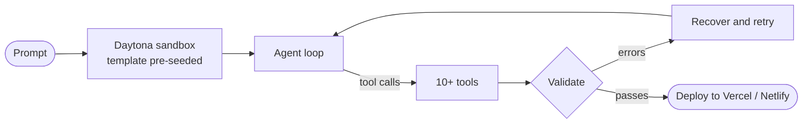

## Omkar Chebale

AI engineer. I build agent harnesses and LLM systems, and I'm going deep on how LLMs are served.

Open to inference, ML and AI engineer roles. Available now. 
[omkarchebale.vercel.app](https://omkarchebale.vercel.app) · [LinkedIn](https://www.linkedin.com/in/omkar-chebale-8b251726b/) · omkarchebale0@gmail.com

 

### What I've built

**Coding-agent platform at AI Planet** · 2026 
You type a prompt, a sandbox spins up, and a coding agent builds and deploys a full-stack Next.js app. I led the platform and built the harness.

- **Context engineering.** The Next.js template is pre-seeded in the sandbox, so the agent never regenerates boilerplate and spends its tokens on the actual app.
- **Bring your own data.** Users connect their own Neon Postgres over MCP.
- **Memory.** Built the memory layer from scratch for the company's multi-agent workflow platform, so conversations persist inside workflows. Also worked on threads, auth, RBAC and worker heartbeat monitoring there.

**B2B commerce platform at RecursiveZero** · 2024 to 2025 
Founding engineer, from the first commit to production: auth, RBAC, multi-business management, MongoDB schema design and query optimization.

 

### Going deep on LLM inference

I learn by taking systems apart and writing up how they work.

| Topic | Write-up |
|---|---|
| Quantization: GPTQ, AWQ, GGUF | [How LLMs fit on your laptop](https://omkarchebale.vercel.app/blogs/quantization-how-llms-fit-on-your-laptop-without-losing-their-mind) |
| Speculative decoding | [Draft models and why decoding gets faster](https://omkarchebale.vercel.app/blogs/speculative-decoding-the-intern-trick-that-makes-llms-13x-faster) |
| KV cache and attention variants | [Multi-Head Latent Attention in DeepSeek](https://omkarchebale.vercel.app/blogs/multi-head-latent-attention-the-memory-trick-behind-deepseek-s-insane-efficiency) |
| Long context | [Why a 1M-token window isn't 1M tokens of memory](https://omkarchebale.vercel.app/blogs/context-windows-are-a-lie-why-1-million-tokens-doesn-t-mean-what-you-think) |

Next: how serving engines batch and schedule requests.

 

### Agent engineering, written up

- [Harness engineering: the system around the model](https://omkarchebale.vercel.app/blogs/harness-engineering-the-shift-that-makes-ai-systems-actually-work-in-production)
- [Tool calling is just JSON](https://omkarchebale.vercel.app/blogs/tool-calling-is-just-json-how-llms-actually-use-tools-without-running-anything)
- [What /compact actually does to your context](https://omkarchebale.vercel.app/blogs/you-re-using-compact-wrong-here-s-what-it-actually-does-under-the-hood)
- [Debugging a Vite proxy inside WebContainer](https://omkarchebale.vercel.app/blogs/why-your-vite-proxy-fails-inside-webcontainer-and-how-to-actually-fix-it)

 

### Projects

| | |
|---|---|
| [**Math Mentor AI**](https://github.com/Chebaleomkar/Math-Mentor-AI) | Multi-agent solver for JEE math: router, parser, RAG, solver and verifier agents, with image (VLM) and voice (Whisper) input. |
| [**Legal Lens**](https://github.com/Chebaleomkar/legal-lens-clause-simplifier) | Gemma 2B fine-tuned with QLoRA on 2,000 legal-to-plain-English pairs. |
| [**AgentBuilder**](https://github.com/Chebaleomkar/AgentBuilder) | Configure agents, orchestrate multi-agent teams, and trace tool calls and token cost. |
| [**portfolio-2.0**](https://github.com/Chebaleomkar/portfolio-2.0) | My blog platform: full-text search, Pinecone recommendations, and an MCP server that lets agents manage posts. |
| [**claude-code-ping**](https://github.com/Chebaleomkar/claude-code-ping) | Claude Code plugin for native Windows notifications, in any terminal. |

 

### Stack

Python · TypeScript · FastAPI · Next.js · PostgreSQL · MongoDB · Redis · Docker · LangGraph · MCP · Pinecone · HuggingFace / PEFT
